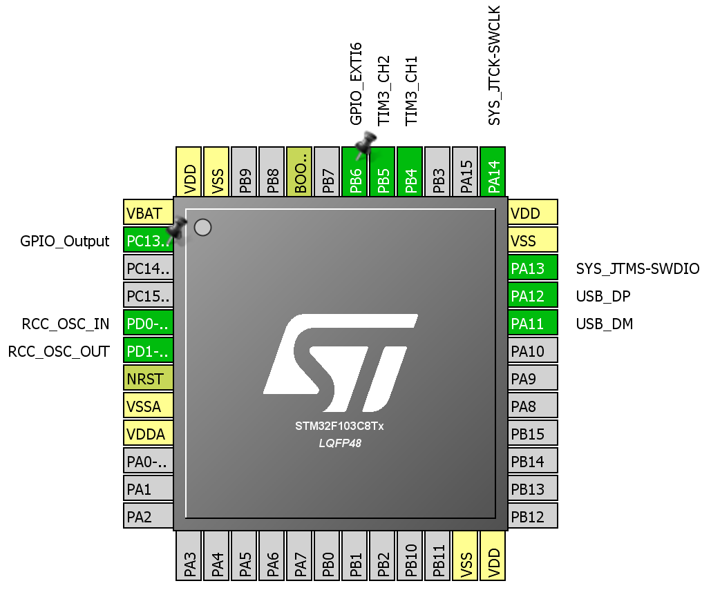

# hc_sr04_test1
STM32F103C8 - Blue Pill and HC-SR04

This project was implemented using project from http://ep.com.pl 
- EP 02/2016 
- Ultradźwiękowy czujnik odległości HC-SR04
- author: Grzegorz Mazur

There is better schematic with level converter.
HC-SR04 works better with 5V voltage.
I cannot observ false detections like in case of using 3.3V only.
I've connected HC-SR04 to port B because this port is 5V tollerant.
Port A cannot tolerate 5V.

The pinout view from STM32CubeMX:

